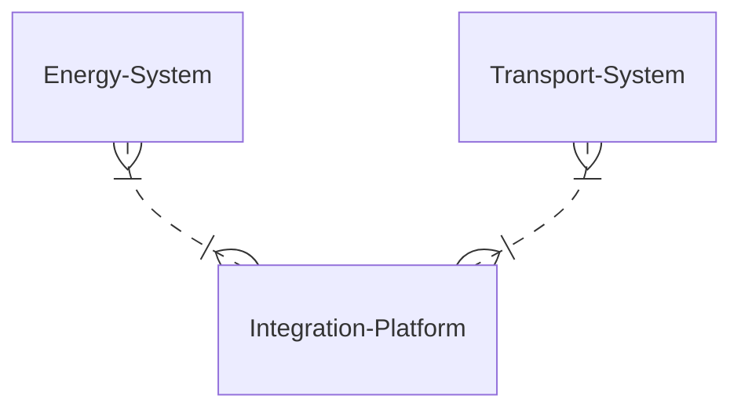
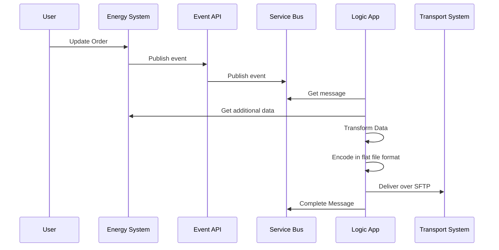

This is example documentation for the ship instruction interface.

# Ship Instruction
The ship instruction interface is triggered by events from the energy system when data changes.  This interface is interested in events related to orders which need to be sent to the transport system to instruct movements of railcars to fulfil customer orders.

## Component View

If we look at the systems involved in this interface it looks like the below.

## Sequence View
If we look at the primary flow of this interface it looks like the below diagram.

